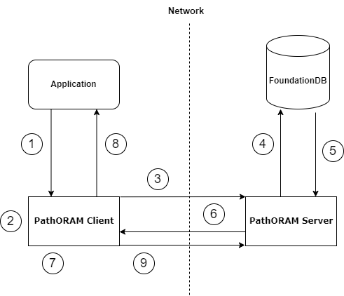

# PIR-against-FoundationDB

## Collaborators 
- Ajay K. Anand
- Austin G. Jamias
- Hitanshi Jain
- Hugo A. Silmberg
- Ruben F Carbajal

## Mentor
- Dan Lambright
- Orran Krieger

## 1. Vision and Goals Of The Project
Our vision is to see the Path ORAM algorithm fully implemented in a client library and a server process between the user application and the FoundationDB server. The entire system should be implemented such that the client exposes a simplified interface of the FoundationDB API to the user, while adversaries cannot infer much information in a compromised database. Along the way, we will create attacks against a database to understand why sole data encryption is not enough to protect information leaking out to adversaries, and why PIR is needed for increased security.

## 2. Users/Personas Of The Project
PIR will be used by anyone who is willing to sacrifice some request performance in exchange for increased data security on top of encryption. Specifically, enterprises, government agencies, or financial institutions that want to retrieve data while protecting their proprietary queries from malicious third parties or suspicious databases.

1. Database Administrator - Sarah
- Role Description: Sarah is a highly skilled Database Administrator responsible for overseeing and maintaining the FoundationDB database system within her organization. She plays a pivotal role in ensuring data integrity, security, and performance.
- Key Characteristics:
  - Responsibilities: Sarah's primary responsibilities include configuring, optimizing, and troubleshooting the FoundationDB database.
  - Security Focus: Sarah is particularly concerned about data security and privacy, especially when dealing with sensitive information in the database.
  - System Maintenance: Sarah routinely performs tasks such as database backups, monitoring system health, and ensuring data consistency.

2. Application Developer - Alex
- Role Description: Alex is an Application Developer responsible for designing, coding, and maintaining software applications that rely on FoundationDB as the backend data store. They are adept at building efficient and responsive applications.
- Key Characteristics:
  - Development Expertise: Alex possesses strong skills in software development, including proficiency in various programming languages, frameworks, and application architecture.
  - Application Integration: They are responsible for seamlessly integrating the FoundationDB database into their applications, enabling data storage and retrieval.
  - Efficiency and Performance Focus: Alex is highly focused on optimizing database interactions within their applications to ensure efficiency and responsiveness to user requests.
  - Data Privacy Awareness: Alex understands the significance of data privacy and is interested in implementing privacy-preserving techniques like Path ORAM to safeguard user information.

These principal user roles, Sarah and Alex, encompass specific characteristics and responsibilities that will guide the design and user scenarios of the Path ORAM Integration with FoundationDB project. These user roles help identify high-level requirements and ensure that the project caters to the needs of these users effectively.

## 3. Scope and Features Of The Project

### Features in Scope:

- Path ORAM Integration: The primary scope of the project is to implement the Path ORAM algorithm as an access method to FoundationDB. This integration will involve both client and server components that act as a front end to FoundationDB.
- Client Library: The client library functions exposed to the user's application should look similar to FoundationDB's "put", "get", "range\_read", and "range\_clear" C API functions. In the background, the library will have to send and receive data to and from the Path ORAM server, and shuffle it to send it back to the server.
- Server Process: The Path ORAM server will listen for incoming requests, store all data in the tree structure, and send the data back to the FoundationDB server via the FoundationDB C API.
- Attack Replication: Replicate a real-world attack that leverages access patterns. This involves simulating an adversarial scenario to analyze and understand the vulnerabilities that might exist within the system when it comes to privacy and access pattern analysis.
- Overhead Analysis: Measure and analyze the overhead introduced by the use of the Path ORAM algorithm for various operations within the FoundationDB system. Explore potential strategies to mitigate this overhead.

### Out-of-Scope:

- Full Application Development: The project's scope is limited to integrating the Path ORAM algorithm with FoundationDB and replicating an attack scenario. It does not include the development of full-fledged applications or services that utilize this integration.
- Advanced Attacks: While the project replicates an attack scenario, it does not encompass advanced attack techniques beyond the scope of the defined attack replication.
- Production-Ready Security: While security considerations are important, the project's primary focus is on integration and analysis. It does not guarantee the development of a production-ready, fully secure system.

## 4. Solution Concept

### Current Architecture

#### Walkthrough Explanation of the above Architectural Structure:

1. Application call get() from library
2. PathORAM client will get the leaf node from the "position map" data structure, within the client 
3. The PathORAM client requests the branch from the PathORAM server leading to the desired leaf node 
4. PathORAM Server will fetch data from FoundationDB on each of the nodes in the branch leading to the leaf
5. FoundationDB server sends data back to PathORAM server and makes the tree strcuture
6. Path ORAM server sends a branch back to PathORAM client get() function
7. PathORAM shuffling Algorithm 
8. get() returns the value of the key
9. The tree is updated after operation

#### In-Depth Explanation of each component within PIR:
Path ORAM Server (Server):
- The Path ORAM Server is the component responsible for implementing one part of the Path ORAM algorithm.
- It stores a binary tree structure full of encrypted data where each node (bucket) contains data blocks, which contains an id.
- It listens for data requests in a tuple: operation type, leaf node id (leftmost id is 1, rightmost is highest), and the actual data (if write operation). 
- It returns all of the data from all of the nodes between the root and the leaf with the requested id (the tree branch) back to the client.
- Then it receives the shuffled branch to update the tree.
- This continuous random shuffling ensures that access patterns are obscured, enhancing data privacy.
- After each branch update, the Path ORAM server updates the key-value pairs in the FoundationDB server via the C API.

Path ORAM Client (Application):
- The Path ORAM Client is a library for an application that consists of functions similar to the FoundationDB C API with the tradeoff in increased security for decreased performance.
- It stores a map that maps the leaf node id to the actual leaf node.
- It sends the request tuple to the Path ORAM server, retrieves a branch, performs the shuffling, and sends it back to the server.
  
FoundationDB:
- FoundationDB serves as the core database infrastructure of the system.
- It stores data in a distributed manner, ensuring data durability, availability, and scalability.
- The Path ORAM server communicates with FoundationDB to execute data operations based on requests from the Path ORAM Client.
  
Distributed Database (DistributedDB):
- DistributedDB represents the collective database system, including multiple instances of FoundationDB, distributed across multiple servers or nodes.
- This distributed architecture enhances the system's fault tolerance and scalability.
- The Path ORAM Server, Path ORAM Client, and FoundationDB Client interact with the distributed database to provide a cohesive and distributed data storage solution.

### Design Implications and Reasons:

The design decisions made during the global architecture design have significant implications for the overall functionality, security, and performance of the system. Here, we discuss the key design decisions and their reasons:

#### Path ORAM Algorithm:
- Implication: The integration of the Path ORAM algorithm is a fundamental design decision aimed at ensuring oblivious data access, which prevents attacks from inferring sensitive information based on access patterns.
- Reason: Path ORAM is chosen for its ability to provide absolute privacy guarantees by constantly shuffling data in a tree structure. This design choice aligns with the project's primary objective of enhancing data privacy within FoundationDB.
  
#### FoundationDB as the Core Database:
- Implication: Using FoundationDB as the core database infrastructure provides scalability and reliability, allowing the system to handle large datasets and high transaction volumes.
- Reason: FoundationDB is a distributed database known for its robustness and scalability. It ensures data durability and availability, making it a suitable choice for the underlying data storage system.
  
## 5. Acceptance criteria
*Minimum Acceptance criteria:*
- Implementing all parts of a path ORAM, both client and server, to an application and the binded FoundationalDB Client 
- Run a sophisticated attack on a Database to test our implementations 
- Deep understanding of questions such as: How to optimize a large position map on the client? Does the tree in the server have to be balanced? What is the right size of the cache?

*Stretch Goals:*
- Implementing the server side of PathOram in between the FoundationalDB client and server to compare its performance versus our original solution
- Being able to run PIR against FoundationDB on Massachuttes Open Cloud (MOC)

## 6. Release Planning

1. Path ORAM Server Implementation
- Implement the Path ORAM server, which includes the data shuffling mechanism within the tree structure.
2. Path ORAM Client Integration
- Develop the Path ORAM client, allowing it to interact with the Path ORAM server and the FoundationDB Client.
3. FoundationDB Client Integration
- Integrate the FoundationDB Client into the system, ensuring that it communicates effectively with the Path ORAM Client.
4. Performance Evaluation
- Begin evaluating the system's performance, focusing on its efficiency and scalability.
5. Sophisticated Attack Simulation
- Develop and execute a sophisticated attack on the database to assess the system's resistance to access pattern analysis.
6. Security Analysis
- Analyze the results of the attack simulation to identify vulnerabilities and potential security improvements.

## 7. Videos
[Sprint 1](https://drive.google.com/file/d/1mzK61GUkCX3TyAa_z3-Qk02gBIUXeQ1o/view?usp=sharing)
[Sprint 2](https://youtu.be/9lLiGHvvhog)
