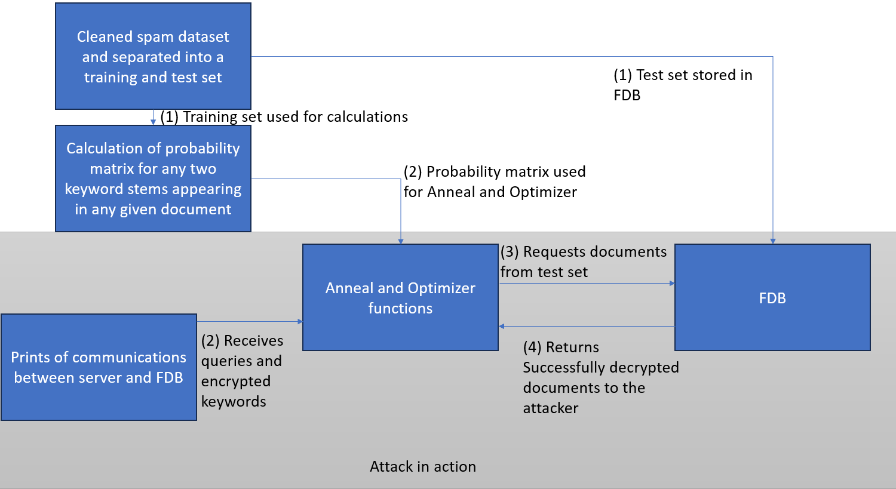

# PIR-against-FoundationDB

## Collaborators 
- Ajay K. Anand
- Austin G. Jamias
- Hitanshi Jain
- Hugo A. Silmberg
- Ruben F. Carbajal

## Mentor
- Dan Lambright
- Orran Krieger
- Ata Turk

## 0. Install Instructions
Make sure that at FoundationDB (7.1.35) is installed. If you are using a RHEL/CentOS based distro, you can use the following commands to install FoundationDB.

	wget https://github.com/apple/foundationdb/releases/download/7.1.35/foundationdb-clients-7.1.35-1.el7.x86_64.rpm
	wget https://github.com/apple/foundationdb/releases/download/7.1.35/foundationdb-server-7.1.35-1.el7.x86_64.rpm
	sudo dnf localinstall -y foundationdb-clients-7.1.35-1.el7.x86_64.rpm foundationdb-server-7.1.35-1.el7.x86_64.rpm
	rm foundationdb-clients-7.1.35-1.el7.x86_64.rpm foundationdb-server-7.1.35-1.el7.x86_64.rpm

To make the Path ORAM server and single client binaries, type 

	make single_client

If you want to use the multiclient mode, type

	make multiclient

You can also explicitly specify the Path ORAM tree parameters. These parameters cannot be changed after defined.

	make SEED=1 DEBUG=1 BYTES=1024 BLOCKS=1 LEVELS=8

SEED=1 sets all random generators to seeded random. This is meant to be used for benchmarking.
DEBUG=1 enables print statements and errors to be shown to verify that the algorithm works.
BYTES=1024 (default) sets each block (block\_id + data) to be 1024 bytes big. It must be a multiple of 16.
BLOCKS=1 (default) sets the amount of blocks per bucket to be 1.
LEVELS=8 (default) sets how many levels the Path ORAM tree contains

Your binaries will be located in '/path/to/repo/bin'

Happy hacking!

## 1. Vision and Goals Of The Project
Our vision is to see the Path ORAM algorithm fully implemented in a client library and a server process between the user application and the FoundationDB server. The entire system should be implemented such that the client exposes a simplified interface of the FoundationDB API to the user, while adversaries cannot infer much information in a compromised database. Along the way, we will create attacks against a database to understand why sole data encryption is not enough to protect information leaking out to adversaries, and why PIR is needed for increased security.

## 2. Users/Personas Of The Project
PIR will be used by anyone who is willing to sacrifice some request performance in exchange for increased data security on top of encryption. Specifically, enterprises, government agencies, or financial institutions that want to retrieve data while protecting their proprietary queries from malicious third parties or suspicious databases.

1. Database Administrator - Sarah
- Role Description: Sarah is a highly skilled Database Administrator responsible for overseeing and maintaining the FoundationDB database system within her organization. She plays a pivotal role in ensuring data integrity, security, and performance.
- Key Characteristics:
  - Responsibilities: Sarah's primary responsibilities include configuring, optimizing, and troubleshooting the FoundationDB database.
  - Security Focus: Sarah is particularly concerned about data security and privacy, especially when dealing with sensitive information in the database.
  - System Maintenance: Sarah routinely performs tasks such as database backups, monitoring system health, and ensuring data consistency.

2. Application Developer - Alex
- Role Description: Alex is an Application Developer responsible for designing, coding, and maintaining software applications that rely on FoundationDB as the backend data store. They are adept at building efficient and responsive applications.
- Key Characteristics:
  - Development Expertise: Alex possesses strong skills in software development, including proficiency in various programming languages, frameworks, and application architecture.
  - Application Integration: They are responsible for seamlessly integrating the FoundationDB database into their applications, enabling data storage and retrieval.
  - Efficiency and Performance Focus: Alex is highly focused on optimizing database interactions within their applications to ensure efficiency and responsiveness to user requests.
  - Data Privacy Awareness: Alex understands the significance of data privacy and is interested in implementing privacy-preserving techniques like Path ORAM to safeguard user information.

These principal user roles, Sarah and Alex, encompass specific characteristics and responsibilities that will guide the design and user scenarios of the Path ORAM Integration with FoundationDB project. These user roles help identify high-level requirements and ensure that the project caters to the needs of these users effectively.

## 3. Scope and Features Of The Project

### Features in Scope:

- Path ORAM Integration: The primary scope of the project is to implement the Path ORAM algorithm as an access method to FoundationDB. This integration will involve both client and server components that act as a front end to FoundationDB.
- Client Library: The client library functions exposed to the user's application should look similar to FoundationDB's "put", "get", "range\_read", and "range\_clear" C API functions. In the background, the library will have to send and receive data to and from the Path ORAM server, and shuffle it to send it back to the server.
- Server Process: The Path ORAM server will listen for incoming requests, store all data in the tree structure, and send the data back to the FoundationDB server via the FoundationDB C API.
- MultiClient Adoption: In the original PathORAM there is only one client that is reading or writing to a database, but with a new architectural system, multiple clients can be enabled to and retrieve the necessary information to have the most recent changes to the data
- Overhead and Performance Analysis: Measure and analyze the overhead introduced by the use of the Path ORAM algorithm for various operations within the FoundationDB system. Explore potential strategies to mitigate this overhead.
- Attack Replication: Replicate a real-world attack that leverages access patterns. This involves simulating an adversarial scenario to analyze and understand the vulnerabilities that might exist within the system when it comes to privacy and access pattern analysis.

### Out-of-Scope:

- Full Application Development: The project's scope is limited to integrating the Path ORAM algorithm with FoundationDB and replicating an attack scenario. It does not include the development of full-fledged applications or services that utilize this integration.
- Advanced Attacks: While the project replicates an attack scenario, it does not encompass advanced attack techniques beyond the scope of the defined attack replication.
- Production-Ready Security: While security considerations are important, the project's primary focus is on integration and analysis. It does not guarantee the development of a production-ready, fully secure system.

## 4. Solution Concept

### Current Architecture

#### Walkthrough Explanation of the above Architectural Structure:

1. In our Architecture the user starts with the Application where they have access to the client library but not the ability to access FoundationDB directly
   - FoundationDB is a key value database
   - A request id is generated 
   - Some of the key functions in the Client library include:
     - put() : adds a new block or updates an existing block with the given key and value
     - get() : retrieves a block with the given key
     - clear() : clears a block with the given key and ensures the block is removed from the server storage and its local mappings
     - read_range() : reads a range of blocks specifies by a beginning and ending key by returning a vector of blocks representing the data
     - clear_range() : clears a range of blocks specific by a beginning and ending key 
2. From there the client will send the operation request to the Master Client, where the state of the position map and stash are being saved locally, and the clients can remain stateless
   - Position Map is a data structure that maintains the mapping between the blocks of data the client wants to store/retrieve and their actual leaf position (1:2^(L-1)) in the server storage
     - each block of data is identified by a block ID and is mapped to a leaf node in a binary tree structure, simulated by an array in the server
     - everytime a block is accessed, its position in the path is randomized by finding the intersection bucket between the original path and the path to the randomly generated leaf id to maintain obliviousness
   - Stash is a local storage area where the blocks are temporarily held when they are fetched from the server but cannot be written back immediately
     - A reason why the block cant be written immediately is all the blocks being full, and would stay in the stash until the next write operation
3. The Master client will receive the request id and will randomly generate a leaf id 
4. The Master Client will then send the request id and leaf id, sent over the network
5. The PathORAM Server then receives the two IDs, and uses the leaf id to fetch a branch, a vector of data blocks that contains all of the blocks from the root bucket to the leaf bucket with the associated leaf id, from FoundationDB.
6. FoundationDB sends the blocks to the Path ORAM server
7. The PathORAM Server then sends the master client the number of blocks being sent and the blocks of data.
8. The Master Client will then do the shuffling among the blocks received, updating the branch, position map, and stash, and carryout the requested operation and send the data to the client if it's a put request.
9. The Master Client will then send the updated branch back to the PathORAM server 
10. The PathORAM Server will receive the blocks and send them to FoundationDB to update the database
11. Once completed, the PathORAM Server will send the request id back to the master client
12. If the master client receives the request id, then it will send it back to the client and print its successful 
13. On a successful operation, the master client will update its state, saving its key-to-block\_id map, position map, and the stash.

#### In-depth explanation of each component within PIR:
Path ORAM Server (Server):
- The Path ORAM Server is the component responsible for implementing one part of the Path ORAM algorithm.
- It stores a binary tree structure full of encrypted data where each node (bucket) contains data blocks, which contains it's identifying block\_id.
- It listens for data requests by receiving the requested leaf bucket id.
- It returns all of the blocks from all of the nodes between the root and the leaf with the requested id (the tree branch) back to the client.
- Then it receives the shuffled branch to update the tree.
- This continuous random shuffling ensures access patterns are obscured, enhancing data privacy.
- After each branch update, the Path ORAM server updates the key-value pairs in the FoundationDB server via the C API.

Master PathORAM Client (Application):
- The Path ORAM Client is a library for an application that consists of functions similar to the FoundationDB C API with the tradeoff in increased security for decreased performance.
- It stores a map that maps key names to block ids, and another map that maps the block id to its current leaf id.
- The introduction of a Master client enables multiple clients since they can retrieve the most recent position map and stash of the system
  
FoundationDB:
- FoundationDB serves as the core database infrastructure of the system.
- It stores data in a distributed manner, ensuring data durability, availability, and scalability.
- The Path ORAM server communicates with FoundationDB to execute data operations based on requests from the Path ORAM Client.

### Design Implications and Reasons:

The design decisions made during the global architecture design have significant implications for the overall functionality, security, and performance of the system. Here, we discuss the key design decisions and their reasons:

#### Path ORAM Algorithm:
- Implication: The integration of the Path ORAM algorithm is a fundamental design decision aimed at ensuring oblivious data access, which prevents attacks from inferring sensitive information based on access patterns.
- Reason: Path ORAM is chosen for its ability to provide absolute privacy guarantees by constantly shuffling data in a tree structure. This design choice aligns with the project's primary objective of enhancing data privacy within FoundationDB.

#### Introduction to Master Client
- Implication: With a component that has the information necessary for the client to retrieve data it enables multiple clients to receive the position map and stash necessary to operate
- Reason: This eliminates the worry of having too much state stored at the end client, by now making them stateless. Also, we are assuming the master client is always safe, under the same assumption as the client in the PathORAM paper is always safe
  
#### FoundationDB as the Core Database:
- Implication: Using FoundationDB as the core database infrastructure provides scalability and reliability, allowing the system to handle large datasets and high transaction volumes.
- Reason: FoundationDB is a distributed database known for its robustness and scalability. It ensures data durability and availability, making it a suitable choice for the underlying data storage system.

#### Network Placement:
- Implication: Putting a network between the PathORAM client and PathORAM server will improve security by preventing unauthorized access to private data.
- Reason: A firewall can monitor and control incoming and outgoing network traffic between the PathaORAM client and PathORAM server. It will also log and monitor the traffic passing to help detect suspicious activity and potential attacks

#### Encryption Process Placement:
- Implication: Encryption is necessary in our process to ensure the private information we are trying to hide is not kept in plain text, and for better design, we decided to put the encryption and decryption process in the block class
- Reason: It encapsulates all the functionalities that are happening on the block object within itself and makes it easier to pass data over the network since it facilitates getting the block id and data regardless of encryption

### Helpful Analogy: 
Lets say you are reading a top secret book and want to keep that hidden from your friends. You decide to hide that book in the library. To make it really difficult for your friends to find the book your reading, you decide to cut the book into pages and hide each page in a different book throughout the library. 

The pages of the book are analogous to the nodes in PathORAM. The library is analogous to the PathORAM server. The PathORAM client is analogous to you, the user who wants to read the top-secret book.

When you want to read the book, you go to the library and request the pages of the book. The PathORAM server does not know which book the pages you requested are in, so it cannot learn which book you are trying to read.

## 5. Acceptance criteria
*Minimum Acceptance criteria:*
- Implement Path ORAM single\_client and server.
- Compare performance with and without the Path ORAM algorithm
- Deep understanding of questions such as: How to optimize a large position map on the client? Does the tree in the server have to be balanced? What is the right size of the cache?

*Stretch Goals:*
- Run a sophisticated attack on a Database to test our implementations 
- Being able to run PIR against FoundationDB on Massachuttes Open Cloud (MOC)

## 6. Inference Attack Model
To test that our PathORAM has been implemented correctly, we will be creating a simulated attack of a compromised database, assuming a correct implementation of the PathORAM algorithm there should not be any data inferred from the attack.

### Planned Architecture of the attack

### Planned Architecture

#### Explanation of the diagram above
1. Receives an array of queries from client to server (The attack has access to all communications with the server)
2. Runs a Porter Stemming Algorithm along with Anneal and Optimizer functions to match keywords with queries
3. Requests encrypted files
4. Receives the documents that were able to be decrypted

Within the attack architecture we will store the queries from the requests to FoundationDB along with matrix Mp and Mc. Matrix Mp and Mc contains the joint frequency distribution of plain and cipher keywords, these matrices allow us to reasonably guess the keyword pairs to the queries. To create these matrix we first will find a large publicly available dataset with all the possible keywords we would expect to find in our targeted attack. 

#### Anneal and Optimizer Functions:
- This algorithm optimizes the keyword assignments to reveal queries by utilizing Simulated Annealing.
- It iteratively modifies the keyword assignments based on the pair similarity matrices and known assignments to minimize the difference between joint frequency distributions of plain and cipher keyword pairs (Mp and Mc).
- The process involves accepting or rejecting new states probabilistically, considering the energy difference and current temperature.
- The loop continues until the temperature reaches zero or a threshold of unsuccessful rejections (rejectThreshold) is met.

## 7. Release Planning
1. Research and Data Storage R/W [09/27/23]
- Learning the architecture of the project and how the process as a whole works
- Two core operations, read and write, be shown to execute with the foundationDB
2. Client & Server Communication and Attack Research[10/11/23]
- Change in environments brought us a little behind schedule since we moved from Windows/Mac -> VM/Rocky Linux 9 -> NERC/rocky Linux 8, so the work in downloading and setting our VMs was not put to use
- Researched a variety of possible attacks that we can replicate
- Debug the PathORAM we intended to implement 
3. FoundationDB & PathORAM Integration [10/25/23]
- Get a working open-source version of PathORAM, either in C++ or Java
- Implement the PathORAM algorithm with FoundationDB in Java, encouraging a pivot point in our project
- Decide on the attack we want to pursue: Our simulated attack must be of a compromised database that can witness access patterns of retrieval by PathORAM
- Set up the types of analysis needed for the future: Overhead and Security
4. FBD & PathORAM fully functioning & Basic Attack [11/08/23]
- Implement client library functions exposed to the user's application (put, get, range\_read, and range\_clear)
- Add Encryption in the Java code
- Evaluate the system's start up time performance in C++
- Mapped out how the inference attack will be orchestrated
- Architected the possibility of multi client PIR system
- Introduction to stateless client and storing the state locally on a Master client
5. Benchmarking and Encryption [11/22/23]
- Finalize the PathORAM system and integrate multiclient 
- Include an array of BenchMarks for the PIR system such as: Java vs C++, Performance based on data sizes, and Performance based on Block Sizes 
- Add AES-256 encryption standard using OpenSSL Library
- Created parts of the Inference Attack, such as key word matrix
- Made data leak test; from trying to find sensitive information over the network or within the server to highlight the security of our system
6. Performance Benchmarking & Attack Simulation [12/6/23]
- Analyze the results of the attack simulation to identify vulnerabilities and potential security improvements.
- Error Handling 
- We refine our performance test to meet a more conclusive result and ensure the comparison of similar environments/systems

## 8. Videos & Slides
### [Sprint 1](https://drive.google.com/file/d/1mzK61GUkCX3TyAa_z3-Qk02gBIUXeQ1o/view?usp=sharing)
#### [Slides for sprint 1](https://docs.google.com/presentation/d/1CD8V3PlY5hwEqNEdIvMwRTETA6OSf6MouFY9GTvDByU/edit?usp=sharing)
In the first sprint we focused on researching and deeply understanding our project as a whole and show a demo regarding writing and reading from the foundationDB
### [Sprint 2](https://youtu.be/9lLiGHvvhog)
#### [Slides for sprint 2](https://docs.google.com/presentation/d/16zytBjmp161QAiiBnQSlX3_3WsU6q6cu52AmnmUFiqs/edit?usp=sharing)
In the second sprint are in the process of setting up everyones enviornment, debugging PathORAM code we found online, researching attacks, and demoed a client and server side communitcaiton of the foundationDB
### [Sprint 3](https://youtu.be/VM-PZuz6tJM)
#### [Slides for sprint 3](https://docs.google.com/presentation/d/1K-Tt-w3QFmhFGA-8sUNrtf0gfOCyxZMtjJOFLlK04D4/edit?usp=sharing)
In the third sprint, we are able to successfully use an open-source PathORAM algorithm and enable its connection to FoundationDB, gaining a better understanding on the attack referenced in the paper, pivoting from our original direction in the project by switching to Java and potentially a new environment.
### [Sprint 4](https://youtu.be/k0n5dColuRE)
#### [Slides for sprint 4](https://docs.google.com/presentation/d/1pp84PhRwiSyWghHc9lZhWW2VgnhMV6PaDHIAit9rQl0/edit?usp=sharing)
In the fourth sprint we implemented client library functions, started a base of encryption, mapped out an attack, added error handling and state saving, have a proof of concept for multiple clients, and a base for benchmarking
### [Sprint 5](https://youtu.be/9e5QJJdv7Sg)
#### [Slides for sprint 5](https://docs.google.com/presentation/d/1jqgMLwRAsqoDXpN-beFdYwLJnAGsZi76gfrrxxyTGLg/edit?usp=sharing)
In the fifth sprint, we accomplished working multi-client architecture in C++. We performed multiple benchmarking tests including: Performance based on data sizes, Performance based on block sizes, and Performance differences between Java vs C++. Also, we incorporated the AES-256 encryption standard through the utilization of the OpenSSL library. We also created security tests for our system, such as parts of the inference attack such as the keyword matrix, and types of data leaks. 

####[Final Presentation Slides](https://docs.google.com/presentation/d/1iaZ8GhRR3_XuDEBKmpN9eMPczE7oB9kNEpvQEyQxOuU/edit?usp=sharing)

## 9. References
[1] Stefanov, Emil & van Dijk, Marten & Shi, Elaine & Fletcher, Christopher & Ren, Ling & Yu, Xiangyao & Devadas, Sahana. (2012). Path ORAM: an extremely simple oblivious RAM protocol. Proceedings of the ACM Conference on Computer and Communications Security. 10.1145/2508859.2516660. [Orginal Paper](https://people.csail.mit.edu/devadas/pubs/PathORam.pdf)

[2] Mohammad Saiful Islam, Mehmet Kuzu, Murat Kantarcioglu Jonsson School of Engineering and Computer Science The University of Texas at Dallas. Access Pattern disclosure on Searchable Encryption: Ramification, Attack and Mitigation
